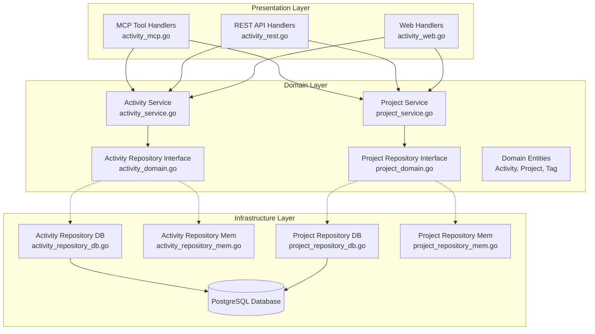

# Design Document

## Overview

The Simple Time Tracking MCP Server will be integrated into the existing Baralga web application under the `/mcp` root path. The server will follow the Model Context Protocol (MCP) specification and expose time tracking functionality through MCP tools via HTTP endpoints, allowing external applications to manage time entries and generate reports. The design leverages the existing Baralga domain components, specifically reusing the tracking domain's Activity entities, services, and repositories.

The MCP server will be accessible via HTTP requests to `/mcp/*` endpoints within the same web application, providing seamless integration while sharing the same codebase, configuration, database connections, and authentication system as the main application. This approach ensures consistency with the main application's data model and business rules while simplifying deployment and maintenance.

## Architecture

### Layered DDD Architecture

The MCP server follows the existing Baralga layered DDD architecture with strict layer dependencies:



### Layer Dependencies

Following the relaxed layered architecture rules:

1. **Presentation Layer** (`activity_mcp.go`, `activity_rest.go`, `activity_web.go`)
   - May depend on Domain Layer (services and domain interfaces)
   - May access repository interfaces from their business domain (defined in domain layer)
   - Cannot directly access Infrastructure Layer repository implementations
   - Handles MCP protocol, HTTP requests, and web UI concerns

2. **Domain Layer** (`activity_service.go`, `activity_domain.go`)
   - Contains business logic, domain entities, and repository interfaces
   - Has NO dependencies on other layers
   - Defines contracts that Infrastructure Layer must implement

3. **Infrastructure Layer** (`activity_repository_db.go`, `activity_repository_mem.go`)
   - May ONLY depend on Domain Layer interfaces
   - Implements repository interfaces defined in Domain Layer
   - Handles data persistence and external system integration

### MCP Protocol Integration

The MCP server integrates at the Presentation Layer using the existing shared MCP utilities:

- **MCP Tool Handlers** (`tracking/activity_mcp.go`) - Presentation Layer
  - Implements MCP tool interfaces using existing `shared.MCPServer`
  - May depend on Domain Layer services (`ActivityService`, `ProjectService`) OR repository interfaces from their business domain
  - Can access `ActivityRepository` and `ProjectRepository` interfaces defined in domain layer
  - Uses existing domain entities and service methods
  - Handles MCP request/response formatting and validation

- **Shared MCP Utilities** (`shared/shared_mcp.go`) - Infrastructure support
  - Provides MCP server setup and protocol handling
  - Integrates with existing Chi router and middleware
  - Handles authentication and principal context creation
  - Supports existing error handling patterns

### Domain Module Structure

The MCP integration maintains the existing domain structure without violating layer boundaries:

```
tracking/                      # Domain module
├── activity_domain.go         # Domain Layer: Entities, interfaces, business rules
├── activity_service.go        # Domain Layer: Business logic and use cases
├── activity_repository_db.go  # Infrastructure Layer: Database implementation
├── activity_repository_mem.go # Infrastructure Layer: In-memory implementation
├── activity_rest.go          # Presentation Layer: REST API handlers
├── activity_web.go           # Presentation Layer: Web UI handlers
└── activity_mcp.go           # Presentation Layer: MCP tool handlers (NEW)

shared/                        # Shared module
├── shared_domain.go          # Domain Layer: Common domain types
├── shared_rest.go            # Presentation Layer: REST utilities
├── shared_web.go             # Presentation Layer: Web utilities
└── shared_mcp.go             # Infrastructure Layer: MCP protocol utilities (NEW)
```

## Components and Interfaces

### Presentation Layer Components

**ActivityMCPHandlers** (in `tracking/activity_mcp.go`) - Presentation Layer
- Implements MCP tool interfaces for activity operations
- May depend on Domain Layer services (`ActivityService`, `ProjectService`) OR repository interfaces (`ActivityRepository`, `ProjectRepository`)
- Can access repository interfaces defined in the domain layer for direct data operations
- Uses existing domain entities and service contracts
- Handles MCP request/response formatting and parameter validation
- Converts domain errors to MCP error responses
- Maintains consistency with existing REST API patterns

**SharedMCPUtilities** (in `shared/shared_mcp.go`) - Infrastructure support for Presentation Layer
- Provides MCP server initialization and protocol handling
- Integrates with existing Chi router and middleware stack
- Handles API key authentication and principal context creation
- Supports existing error handling and logging patterns
- Manages MCP tool registration and capability negotiation

### Domain Layer Components (Existing - No Changes)

**Activity** - Domain entity from `tracking.Activity`
```go
type Activity struct {
    ID             uuid.UUID
    Start          time.Time
    End            time.Time
    Description    string
    ProjectID      uuid.UUID
    OrganizationID uuid.UUID
    Username       string
    Tags           []*Tag
}
```

**ActivityRepository** - Domain interface from `tracking/activity_domain.go`
- `FindActivityByID(ctx, activityID, organizationID)` - Get single activity
- `InsertActivity(ctx, activity)` - Create new activity
- `UpdateActivity(ctx, organizationID, activity)` - Update existing activity
- `DeleteActivityByID(ctx, organizationID, activityID)` - Delete activity
- `FindActivities(ctx, filter, pageParams)` - List activities with filtering
- `TimeReportByDay/Week/Month/Quarter(ctx, filter)` - Time aggregation reports
- `ProjectReport(ctx, filter)` - Project-based reports

**ActivityService** - Domain service from `tracking/activity_service.go`
- `CreateActivity(ctx, principal, activity)` - Create with validation and tags
- `UpdateActivity(ctx, principal, activity)` - Update with validation
- `DeleteActivityByID(ctx, principal, activityID)` - Delete with authorization
- `ReadActivitiesWithProjects(ctx, principal, filter, pageParams)` - List with projects
- `TimeReports(ctx, principal, filter, aggregateBy)` - Time summaries
- `ProjectReports(ctx, principal, filter)` - Project summaries

**ProjectService** - Domain service from `tracking/project_service.go`
- `ReadProjects(ctx, principal, filter, pageParams)` - List all projects with UUIDs

### Infrastructure Layer Components (Existing - No Changes)

**ActivityRepositoryDB** - Database implementation from `tracking/activity_repository_db.go`
- Implements `ActivityRepository` interface
- Handles PostgreSQL database operations
- Manages transactions and connection pooling

**ActivityRepositoryMem** - In-memory implementation from `tracking/activity_repository_mem.go`
- Implements `ActivityRepository` interface
- Used for testing and development
- Provides fast, isolated testing environment

### MCP Tool Implementation Strategy

**Layer Compliance**
- MCP handlers in Presentation Layer may depend on Domain Layer services OR repository interfaces from their business domain
- Can access repository interfaces defined in Domain Layer (e.g., `ActivityRepository`, `ProjectRepository`)
- No direct access to Infrastructure Layer repository implementations (e.g., `ActivityRepositoryDB`)
- Business logic can be handled in Domain Layer services or directly in handlers using repository interfaces
- Data access abstracted through Domain Layer repository interfaces

**Tool Handler Pattern**
Each MCP tool handler will:
1. Parse and validate MCP tool call parameters (Presentation Layer responsibility)
2. Create appropriate `shared.Principal` context for authorization
3. Call existing Domain Layer service methods OR use repository interfaces directly (maintaining layer boundaries)
4. Transform domain objects to MCP response format (Presentation Layer responsibility)
5. Handle domain errors and convert to MCP error responses

**Repository Access Pattern**
When accessing repositories directly, MCP handlers will:
1. Use repository interfaces defined in domain layer (e.g., `ActivityRepository` from `activity_domain.go`)
2. Receive repository implementations via dependency injection
3. Apply business validation and authorization logic within the handler
4. Handle transactions using existing `shared.RepositoryTxer` patterns

**Service/Repository Integration Options**
MCP handlers can choose between service layer or direct repository access:

**Option 1: Service Layer Integration**
- `create_entry` → `ActivityService.CreateActivity()` (Domain Layer)
- `get_entry` → `ActivityService.ReadActivitiesWithProjects()` (Domain Layer)
- `update_entry` → `ActivityService.UpdateActivity()` (Domain Layer)
- `delete_entry` → `ActivityService.DeleteActivityByID()` (Domain Layer)
- `list_entries` → `ActivityService.ReadActivitiesWithProjects()` (Domain Layer)
- `get_summary` → `ActivityService.TimeReports()` (Domain Layer)
- `get_hours_by_project` → `ActivityService.ProjectReports()` (Domain Layer)
- `list_projects` → `ProjectService.ReadProjects()` (Domain Layer)

**Option 2: Direct Repository Integration**
- `create_entry` → `ActivityRepository.InsertActivity()` (Domain Interface)
- `get_entry` → `ActivityRepository.FindActivityByID()` (Domain Interface)
- `update_entry` → `ActivityRepository.UpdateActivity()` (Domain Interface)
- `delete_entry` → `ActivityRepository.DeleteActivityByID()` (Domain Interface)
- `list_entries` → `ActivityRepository.FindActivities()` (Domain Interface)
- `get_summary` → `ActivityRepository.TimeReportByDay/Week/Month/Quarter()` (Domain Interface)
- `get_hours_by_project` → `ActivityRepository.ProjectReport()` (Domain Interface)
- `list_projects` → `ProjectRepository.FindProjects()` (Domain Interface)

## Data Models

### Core Entities (Reused from Baralga)

**Activity** (from `tracking.Activity`)
- `ID`: UUID identifier
- `Start`: Entry start timestamp
- `End`: Entry end timestamp  
- `Description`: Text description of work performed
- `ProjectID`: UUID reference to project
- `OrganizationID`: UUID for multi-tenancy
- `Username`: User who created the entry
- `Tags`: Associated tags with colors

**ActivitiesFilter** (from `tracking.ActivitiesFilter`)
- `Start`: Start date filter
- `End`: End date filter
- `OrganizationID`: Organization context
- `Username`: User filter (for non-admin access)
- `SortBy`: Sort field
- `SortOrder`: Sort direction

**ActivityTimeReportItem** (from `tracking.ActivityTimeReportItem`)
- `Year/Quarter/Month/Week/Day`: Time period identifiers
- `DurationInMinutesTotal`: Total minutes for the period

### MCP Request/Response Models (Reusing Existing API Structures)

**activityModel** (from `tracking/activity_rest.go`)
```go
type activityModel struct {
    ID          string         `json:"id"`
    Start       string         `json:"start" validate:"required"`
    End         string         `json:"end" validate:"required"`
    Description string         `json:"description" validate:"max=500"`
    Duration    *durationModel `json:"duration"`
    Links       *hal.Links     `json:"_links"`
}

type durationModel struct {
    Hours     int     `json:"hours"`
    Minutes   int     `json:"minutes"`
    Decimal   float64 `json:"decimal"`
    Formatted string  `json:"formatted"`
}
```

**projectModel** (from `tracking/project_rest.go`)
```go
type projectModel struct {
    ID          string     `json:"id"`
    Title       string     `json:"title" validate:"required,min=3,max=100"`
    Description string     `json:"description" validate:"max=500"`
    Active      bool       `json:"active"`
    Links       *hal.Links `json:"_links"`
}
```

**MCP Tool Parameters** (Simple parameter structures for MCP tools)
- MCP tools will accept simple parameter objects with basic validation
- Responses will use the existing `activityModel` and `projectModel` structures
- Existing mapping functions (`mapToActivity`, `mapToActivityModel`, etc.) will be reused
- This ensures consistency between REST API and MCP server responses

## Error Handling

### Error Categories

1. **Authentication Errors** - Missing or invalid API key (email address)
2. **Authorization Errors** - User not found or insufficient permissions
3. **Validation Errors** - Invalid input parameters, constraint violations
4. **Not Found Errors** - Requested resources don't exist
5. **Business Logic Errors** - Domain rule violations (e.g., end time before start time)
6. **System Errors** - Database connection issues, internal server errors

### Error Response Format

All errors will be returned as MCP error responses with structured error information:
```json
{
  "error": {
    "code": -32602,
    "message": "Invalid params",
    "data": {
      "type": "validation_error",
      "details": "End time must be after start time"
    }
  }
}
```

### Error Handling Strategy

- API key authentication at the middleware level (email address validation)
- User lookup and principal context creation from authenticated email
- Input validation at the tool handler level using go-playground/validator
- Business rule validation in the service layer
- Repository errors wrapped and propagated with context
- Consistent error response formatting across all tools
- Logging of errors for debugging and monitoring

### Authentication Flow (Respecting Layer Boundaries)

**Presentation Layer Responsibilities:**
1. Extract API key from HTTP header (`X-API-Key` or `Authorization: Bearer <email>`)
2. Validate email format and basic parameter validation
3. Create `shared.Principal` context using existing authentication patterns
4. Handle authentication errors and convert to MCP error responses
5. Apply authorization logic when accessing repositories directly (organization-based filtering)

**Domain Layer Integration:**
1. Pass principal context to existing Domain Layer service methods OR repository interfaces
2. Services handle authorization using existing business rules
3. Repository interfaces accessible from Presentation Layer for direct data operations
4. Authorization logic must be applied in handlers when bypassing service layer

**Infrastructure Layer (No Changes):**
- User lookup via existing `UserRepository.FindUserByUsername(ctx, email)`
- Database operations handled through existing repository implementations

### Layer-Compliant Service/Repository Integration

**Domain Layer Services (No Modifications Required):**
- `ActivityService.CreateActivity(ctx, principal, activity)` - Create entries
- `ActivityService.ReadActivitiesWithProjects(ctx, principal, filter, pageParams)` - List entries  
- `ActivityService.UpdateActivity(ctx, principal, activity)` - Update entries
- `ActivityService.DeleteActivityByID(ctx, principal, activityID)` - Delete entries
- `ActivityService.TimeReports(ctx, principal, filter, aggregateBy)` - Time summaries
- `ActivityService.ProjectReports(ctx, principal, filter)` - Project summaries
- `ProjectService.ReadProjects(ctx, principal, filter, pageParams)` - List all projects with UUIDs

**Domain Layer Repository Interfaces (Available to Presentation Layer):**
- `ActivityRepository.InsertActivity(ctx, activity)` - Create entries
- `ActivityRepository.FindActivityByID(ctx, activityID, organizationID)` - Get single entry
- `ActivityRepository.UpdateActivity(ctx, organizationID, activity)` - Update entries
- `ActivityRepository.DeleteActivityByID(ctx, organizationID, activityID)` - Delete entries
- `ActivityRepository.FindActivities(ctx, filter, pageParams)` - List entries with filtering
- `ActivityRepository.TimeReportByDay/Week/Month/Quarter(ctx, filter)` - Time summaries
- `ActivityRepository.ProjectReport(ctx, filter)` - Project summaries
- `ProjectRepository.FindProjects(ctx, filter, pageParams)` - List all projects

**Presentation Layer Models (Reused):**
- `activityModel` - Request/response structure from `tracking/activity_rest.go`
- `projectModel` - Project structure from `tracking/project_rest.go`
- `mapToActivity()` / `mapToActivityModel()` - Existing conversion functions

**Infrastructure Layer (No Changes):**
- Repository implementations remain unchanged
- Database schema and migrations unchanged
- Transaction handling through existing `shared.RepositoryTxer`

## Testing Strategy

### Unit Testing Approach (Layer-Compliant)

**Presentation Layer Testing (MCP Handlers)**
- Test MCP tool handlers in isolation using mocked Domain Layer services OR in-memory repository implementations
- Verify MCP request/response formatting and parameter validation
- Test error handling and conversion from domain errors to MCP errors
- Validate principal context creation and authentication flow
- Test tool registration and capability negotiation
- Use existing validation patterns from REST handler tests
- When testing direct repository access, use in-memory implementations for fast, isolated tests

**Domain Layer Testing (No Changes)**
- Continue using existing in-memory repository implementations for service testing
- Test business logic in isolation from presentation concerns
- Verify domain validation rules and authorization logic
- Test service methods with various principal contexts and scenarios
- Maintain existing test coverage and patterns

**Infrastructure Layer Testing (No Changes)**
- Continue using existing database integration tests
- Test repository implementations against real PostgreSQL database
- Verify transaction handling and data persistence
- Use existing dockertest setup for database testing

**Integration Testing (Respecting Layer Boundaries)**
- Test complete MCP flow using real Domain Layer services OR direct repository access with in-memory repositories
- Verify layer boundaries are maintained (repository interfaces from domain layer, no direct infrastructure access)
- Test authentication and authorization through existing service layer OR handler-level authorization logic
- Validate compatibility with existing domain validation rules
- Test error propagation through all layers while maintaining separation
- Test both service-based and repository-based handler implementations

### Integration Testing

**End-to-End MCP Testing (Layer-Aware)**
- Test complete MCP protocol communication through all layers
- Verify tool discovery and capability negotiation at Presentation Layer
- Test business logic through Domain Layer services OR direct repository interface access
- Validate JSON-RPC 2.0 compliance with existing Baralga data patterns
- Ensure layer boundaries are maintained throughout the testing flow (domain interfaces only, no infrastructure implementations)

**Database Integration (Infrastructure Layer)**
- Reuse existing PostgreSQL database and schema from Baralga
- Test through Domain Layer services OR repository interfaces (not direct infrastructure implementations)
- Leverage existing transaction handling through `shared.RepositoryTxer`
- Use existing test data fixtures and organization setup
- Maintain existing migration system and data structures

### Test Data Management

- Reuse existing Baralga test fixtures and factory functions
- Leverage existing in-memory repository implementations for fast tests
- Use existing organization and user setup from Baralga test utilities
- Maintain compatibility with existing database cleanup and isolation patterns